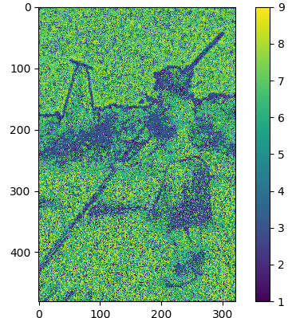
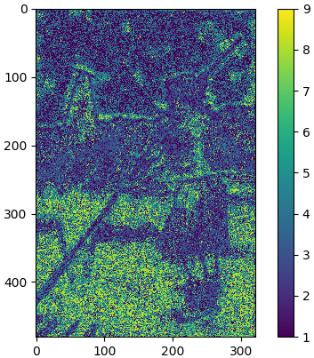
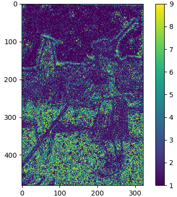
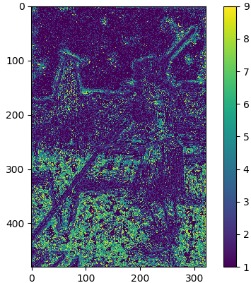
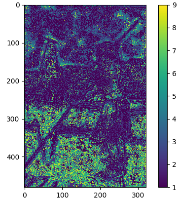

# [PixelRL](https://arxiv.org/abs/1811.04323)


`Pytorch reproduction of pixelRL.`

`If it helps you with your research, please star it. 🎈`

# Requirements and Dependencies
- pytorch 0.4.1+
- python 3.5+


The PixelRL Denoiser 
----------
* Grayscale image denoising

   
   
   
   
   

`Just run Train_torch.py.`


# Citation

Please quote the original paper.

```
@inproceedings{aaai_furuta_2019,
    author={Ryosuke Furuta and Naoto Inoue and Toshihiko Yamasaki},
    title={Fully Convolutional Network with Multi-Step Reinforcement Learning for Image Processing},
    booktitle={AAAI Conference on Artificial Intelligence (AAAI)},
    year={2019}
}
@article{furuta2020pixelrl,
    title={PixelRL: Fully Convolutional Network with Reinforcement Learning for Image Processing},
    author={Ryosuke Furuta and Naoto Inoue and Toshihiko Yamasaki},
    journal={IEEE Transactions on Multimedia (TMM)},
    year={2020},
    volume={22},
    number={7},
    pages={1704-1719}
}
```


